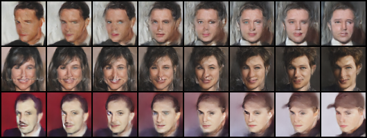
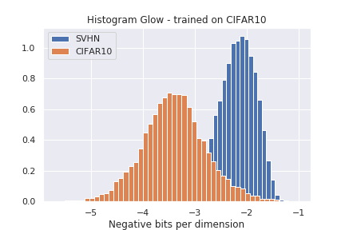

# Glow

## Start HW7 task1 training
`source task1_run_train.sh`

## Start HW7 task2 training
`source task2_run_train.sh`

## task2 Conditional face generation
`python3 task2_Conditional_face.py`


## task2 Linear interpolation
`python3 task2_interpolation.py`



## task2 Attribute manipulation
`python3 task2_Attribute_manipulation.py`


## Origin Repo Intro
This repository implements the [Glow](https://arxiv.org/abs/1807.03039) model using PyTorch on the CIFAR-10 and SVHN dataset. We use the trained Glow to reproduce some of the results of the paper ["Do Deep Generative Models Know What They Don't Know?"](https://arxiv.org/abs/1810.09136):



**To create histogram**:
See [notebook](Do_deep_generative_models_know_what_they_dont_know.ipynb).
Pretrained model (on CIFAR-10): [download](http://www.cs.ox.ac.uk/people/joost.vanamersfoort/glow.zip) (unzip before use).

Note this pretrained model was created using the `affine` coupling layer, so it does not work well for generative sampling (see qualitative vs quantitative models in the Glow paper). The pretrained model achieves 3.39 bpd, while the original paper gets 3.35. The difference between our pretrained model and the paper is that we use batch size 64 (single GPU) and the paper uses 512 (8 GPU).

This code uses some layers and groundwork from [glow-pytorch](https://github.com/chaiyujin/glow-pytorch), but is more modular, extendable, faster, easier to read and supports training on CIFAR-10 and SVHN. There are fewer dependencies and a consistent interface for new datasets. Thanks to [Milad](https://github.com/mi-lad) for comments and help with debugging.


## Setup and run

The code has minimal dependencies. You need python 3.6+ and up to date versions of:

```
pytorch (tested on 1.1.0)
torchvision
pytorch-ignite
tqdm
```

To install in a local conda:

```
conda install pytorch torchvision pytorch-ignite tqdm -c pytorch
```

**To train your own model:**

```
python train.py --download
```

Will download the CIFAR10 dataset for you, and start training. The defaults are tested on a `1080Ti`, Glow is a memory hungry model and it might be necessary to tune down the model size for your specific GPU. The output files will be send to `output/`.

Everything is configurable through command line arguments, see

```
python train.py --help
```

for what is possible.

## Evaluate

There are two notebooks available for evaluation:

* The [first notebook](Do_deep_generative_models_know_what_they_dont_know.ipynb) reproduces a plot from "Do Deep Generative models know what they don't know?" (see above) and computes the average bpd on the CIFAR-10 and SVHN test sets.
* The [second notebook](Sample_from_Glow.ipynb) allows you to visualise samples from the model (This works best with a model trained using the `additive` coupling layer).


## Extensions

There are several possible extensions:

- Multiclass conditional training
- multiGPU
- port over the [tests](https://github.com/chaiyujin/glow-pytorch/blob/master/test_modules.py)

PRs for any of these would be very welcome. If you find any problem, feel free to make an [issue](https://github.com/y0ast/Glow-PyTorch/issues) too.

The model is trained using `adamax` instead of `adam` as in the original implementation. Using `adam` leads to a NLL of 3.48 (vs. 3.39 with `adamax`). Note: when using `adam` you need to set `warmup` to 1, otherwise optimisation gets stuck in a poor local minimum. It's unclear why `adamax` is so important and I'm curious to hear any ideas!

## References:

```
@inproceedings{kingma2018glow,
  title={Glow: Generative flow with invertible 1x1 convolutions},
  author={Kingma, Durk P and Dhariwal, Prafulla},
  booktitle={Advances in Neural Information Processing Systems},
  pages={10215--10224},
  year={2018}
}

@inproceedings{nalisnick2018do,
    title={Do Deep Generative Models Know What They Don't Know? },
    author={Eric Nalisnick and Akihiro Matsukawa and Yee Whye Teh and Dilan Gorur and Balaji Lakshminarayanan},
    booktitle={International Conference on Learning Representations},
    year={2019},
    url={https://openreview.net/forum?id=H1xwNhCcYm},
}
```
